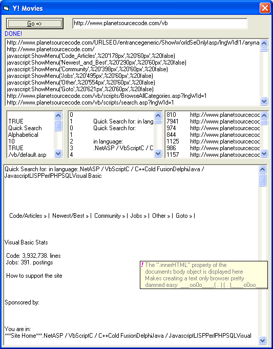



## WWWebFast :::: This is two submissions in one\.\.A web class that is super fast and exposes all of the

### Description

This is a webclass that makes it super easy for you to access the document object, the document.body object, all of the links, image, input elements, and table cells for a web page. And because there is no visible interface (directly anyway)..the pages load super super fast...the second part of this submission is a quick and dirty way to provide your applications with multiline tool tips. Please vote because my Im not strong enouph to pick my head up off the sand and put it back on my body but if i get a lot of good votes that will inspire me a little
 
### More Info
 

             |
---                |---
**Submitted On**   |2005-01-21 06:21:38
**By**             |[Evan Toder](https://github.com/Planet-Source-Code/PSCIndex/blob/master/ByAuthor/evan-toder.md)
**Level**          |Intermediate
**User Rating**    |3.7 (22 globes from 6 users)
**Compatibility**  |VB 4\.0 \(16\-bit\), VB 5\.0, VB 6\.0
**Category**       |[Custom Controls/ Forms/  Menus](https://github.com/Planet-Source-Code/PSCIndex/blob/master/ByCategory/custom-controls-forms-menus__1-4.md)
**World**          |[Visual Basic](https://github.com/Planet-Source-Code/PSCIndex/blob/master/ByWorld/visual-basic.md)
**Archive File**   |[WWWebFast\_1842471212005\.zip](https://github.com/Planet-Source-Code/evan-toder-wwwebfast-this-is-two-submissions-in-one-a-web-class-that-is-super-fast-and-exp__1-58412/archive/master.zip)

